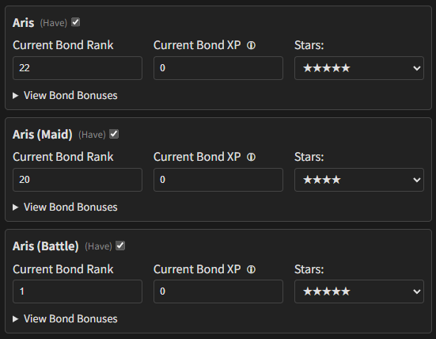
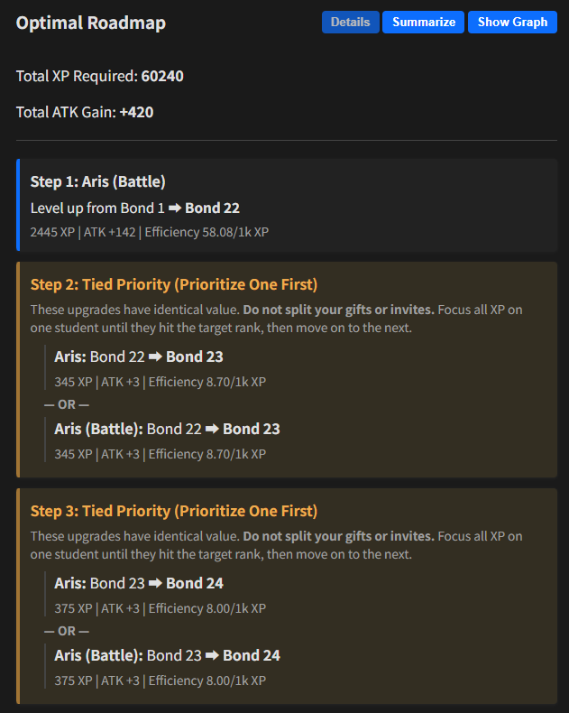
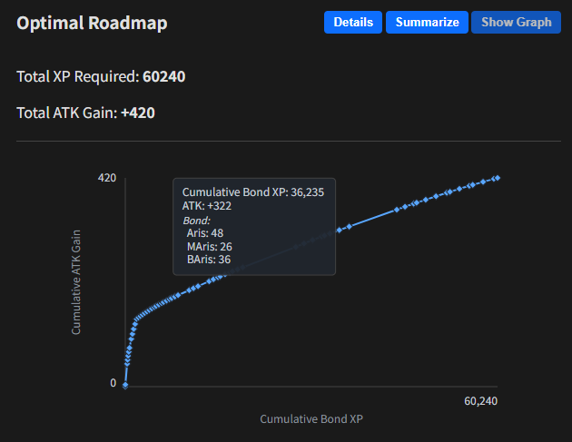
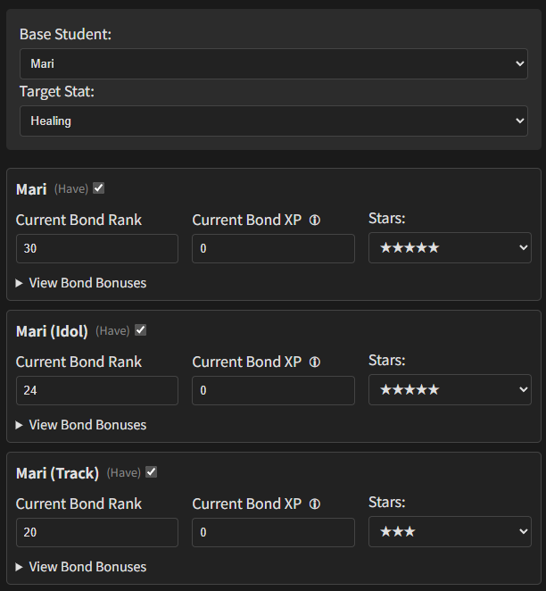
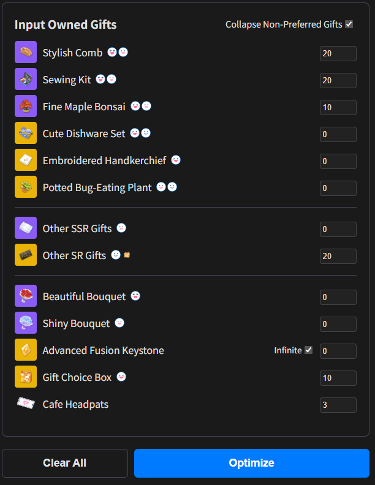
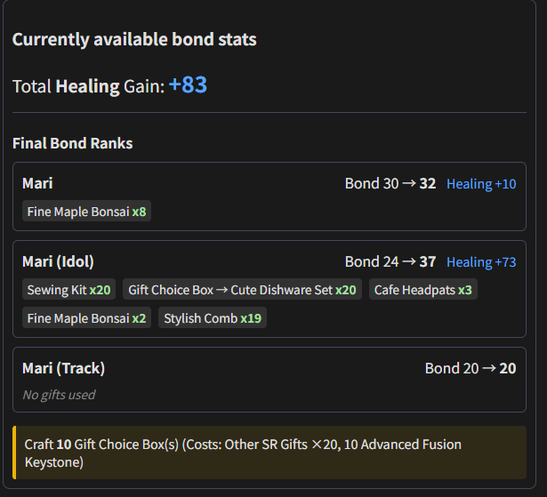

# Bond Stat Optimizer

A simple web tool to calculate the most efficient path for raising student bond ranks in *Blue Archive* to maximize stat gains.

## How to Use

Go to the site at [link](https://aemonjape.github.io/shirokonadenade/).

Select a student and bonus stat that you wish to earn.

Then, select which alts you have, and your current bond rank for each student.

The app will calculate an optimal usage route of bond XP for bonus stat gains.

A summary can be produced and copied for your own memos.

Only students with alts are in the database.

## Using the Rank 50 Roadmap

Say you want your Aris (Battle) to be the strongest and have better ATK.

Leveling up the bond ranks on Aris, Aris (Maid), and Aris (Battle) will increase ATK.

However, the amout of ATK bonus gained per bond level and the required bond XP are not constant.

<details><summary>Example Input</summary>

</details>

The site, when entered you circumstance, will find the most efficient way to maximize returns on ATK, eventually reaching the max bond level for all alts. This can be used to prioritize cafe invites, schedule meetings, and gifts (with the same preference level). You may also want to abort bond leveling when the efficiency becomes very small.

<details><summary>Output Roadmap</summary>



```
BAris 22
Tied: Aris 23, BAris 23
Tied: Aris 24, BAris 24
Tied: Aris 25, BAris 25
MAris 21
Tied: Aris 26, BAris 26
MAris 22
Tied: Aris 27, BAris 27
MAris 23
Tied: Aris 28, BAris 28
Tied: Aris 33, BAris 33
MAris 24
Tied: Aris 34, BAris 34
MAris 25
Tied: Aris 35, BAris 35
Aris 46
MAris 26
BAris 36
Aris 48
BAris 45
MAris 27
BAris 46
Aris 50
MAris 28
BAris 48
MAris 29
BAris 50
MAris 30
```

</details>

## Using the Currently Available Stat Calc

Suppose you lack a bit of healing stat on Mari (Idol) to save a particular student in a boss raid.

Since you do not wish to use Eligma to increase her UE level, you decide to gift the 3 Mari's until her healing meets the surviving theshold.

Use the second mode, "Currently available bond stats", and enter the amount of gifts you have.

<details><summary>Example Input</summary>



</details>

The calculator will give a way to spend your gifts for the currently optimal "bonus healing" stat return. However, it may not be optimal in the long run, where you eventually level up all alts to their max bond rank. Use this mode when you have a tight deadline and have to maximize bond stats during a certain in-game event.

<details><summary>Example Output</summary>

</details>

## Asset Disclaimer

All characters, character names, images, and other game-related assets from *Blue Archive* are the intellectual property of NEXON Games Co., Ltd. and/or their respective copyright holders. This project is a fan-made tool and is not affiliated with, endorsed, or sponsored by NEXON Games. The use of these assets is for informational and identification purposes only.

## License

The code for this project is licensed under the MIT License.

Permission is hereby granted, free of charge, to any person obtaining a copy
of this software and associated documentation files (the "Software"), to deal
in the Software without restriction, including without limitation the rights
to use, copy, modify, merge, publish, distribute, sublicense, and/or sell
copies of the Software, and to permit persons to whom the Software is
furnished to do so, subject to the following conditions:

The above copyright notice and this permission notice shall be included in all
copies or substantial portions of the Software.

THE SOFTWARE IS PROVIDED "AS IS", WITHOUT WARRANTY OF ANY KIND, EXPRESS OR
IMPLIED, INCLUDING BUT NOT LIMITED TO THE WARRANTIES OF MERCHANTABILITY,
FITNESS FOR A PARTICULAR PURPOSE AND NONINFRINGEMENT. IN NO EVENT SHALL THE
AUTHORS OR COPYRIGHT HOLDERS BE LIABLE FOR ANY CLAIM, DAMAGES OR OTHER
LIABILITY, WHETHER IN AN ACTION OF CONTRACT, TORT OR OTHERWISE, ARISING FROM,
OUT OF OR IN CONNECTION WITH THE SOFTWARE OR THE USE OR OTHER DEALINGS IN THE
SOFTWARE.
